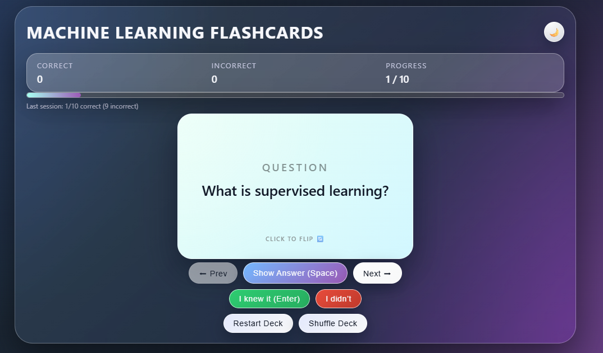

# 🧠 Flashcards Quiz Web App

An interactive flashcards-style quiz application built using **HTML, CSS, and JavaScript**, designed to help students revise key concepts.  
This project was developed using **Cursor.ai**, an AI coding assistant, and hosted on **Vercel**.

---

## 🎯 Project Objective

Create a clean and simple web app where users can:
- Flip flashcards to view question & answer
- Toggle answers visibility
- Track quick scores based on “I knew it” / “I didn’t” responses

Perfect for revising basic Machine Learning topics in a fun and fast way!

---

## 🚀 Live Demo

👉 [Click to Open the App](https://flashcards-quiz-rouge.vercel.app/)

---

## ✨ Features

- 🎴 Flip-style flashcards with question & answer
- ⏭️ Next / Previous navigation
- 👀 Show/Hide Answer toggle
- ✅ “I knew it” / ❌ “I didn’t” buttons to track progress
- 📚 6–10 sample flashcards (Topic: ML Basics)

---

## 🛠️ Tech Stack

| Tool | Purpose |
|------|---------|
| HTML/CSS/JS | Frontend structure and interactivity |
| Cursor.ai | AI-powered code generation and edits |
| Vercel | Hosting and deployment |

---

## 📸 Preview Screenshot (Optional)

---

## 📌 Topics Covered in Flashcards

- What is supervised learning?
- Difference between classification and regression
- Overfitting vs Underfitting
- What is a confusion matrix?
- What is model accuracy?
*(and more...)*

---

## 🤝 Acknowledgements

Built as part of a mini project to experiment with AI-assisted coding using Cursor.ai.

---

## 📬 Connect with Me

**Daksh Khandelwal**  
1st Year BS in AI & Data Science @ IIT Jodhpur  
📧 dk.khandelwaliitj@gmail.com  
🔗 [LinkedIn Profile](https://www.linkedin.com/in/daksh-khandelwal-b02748391/)
